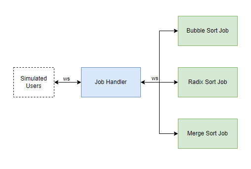

This is a sample system used to generate CDL files that can be used to extract unique traces. 

The system consists of 4 programs:

- Job Handler 
- Merge Sort Worker
- Radix Sort Worker
- Bubble Sort Worker 

The job handler starts a websocket server which accepts incoming connections from the client and each of the workers. When the workers connect to the job handler, they are registered and the type of they job they process is indexed. 

When the client connects to the job handler, it first registers the client connection. Any subsequent messages contain a request with a job type and this passed onto the relevant workers. The workers process the job and return a result which is passed back to the client. 

The simulateClient.py program connects to the job handler and periodically sends jobs to the job handler from different users and accepts the results.

To run the system, start the program in the following order:
- Job Handler
- Start Workers
- Start Simulated Client

I will automate this process soon, I am just manually running the programs to generate logs that I can use to extract system level traces.

